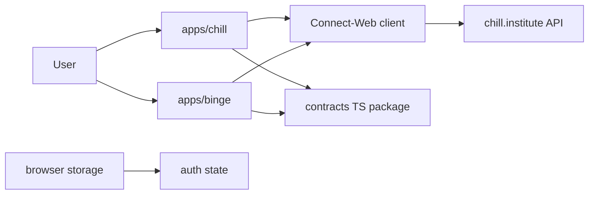
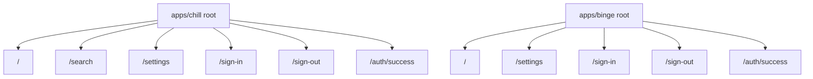
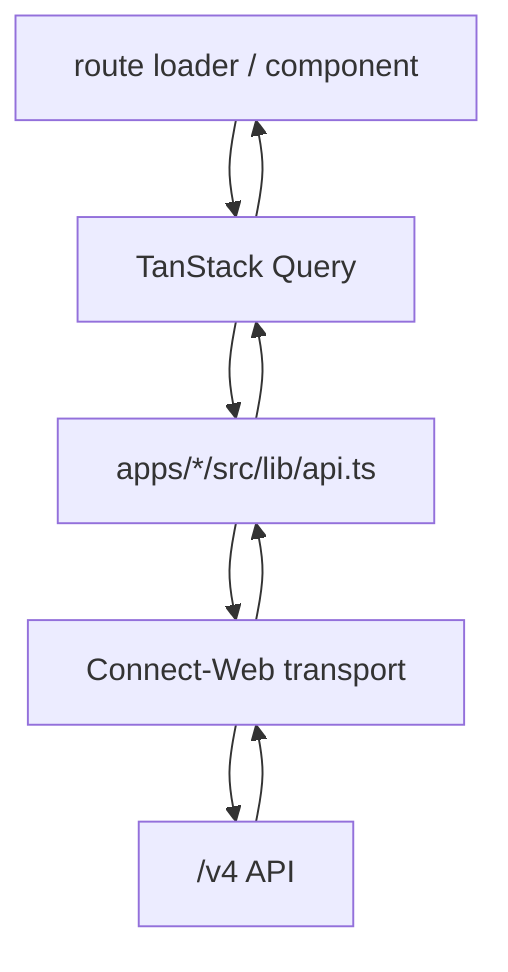
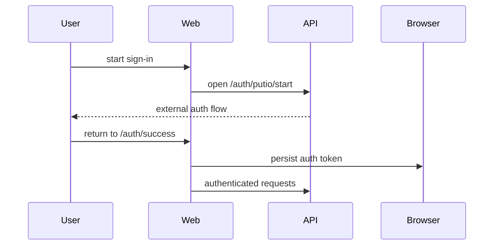

# Architecture

This document describes how `chill-institute-web` is structured as a Vite+ workspace hosting both web apps.

## System Context

## Workspace Layout

| Path          | Responsibility                                                        |
| ------------- | --------------------------------------------------------------------- |
| `apps/chill/` | `chill.institute` app with search, catalog, settings, and auth routes |
| `apps/binge/` | `binge.institute` app with catalog, settings, and auth routes         |
| repo root     | workspace scripts, Vite+ config, lint/format config, CI entrypoints   |

## Workspace Tooling

The repo root owns the shared workspace contract:

- `package.json` for root commands such as `vp run verify`, `vp run verify:chill`, and `vp run e2e:binge`
- `pnpm-workspace.yaml` for package globs and shared dependency catalog entries
- `vite.config.ts` for root formatting, lint, and staged-check behavior
- `.github/workflows/` for selective verify, preview deploy, and production deploy wiring

Each app owns its app-local config:

- `components.json`
- `index.html`
- `playwright.config.ts`
- `tsconfig.json`
- `vite.config.ts`

## Runtime Model

- Each app is its own client-rendered SPA.
- The browser calls the hosted API directly for normal app traffic.
- Shared contract types come from `@chill-institute/contracts`
- UI and query code are intentionally duplicated between apps for now. We have not introduced shared `packages/` boundaries yet.

## App Shape

Each app keeps the same broad internal layers:

| Layer         | Responsibility                                                     |
| ------------- | ------------------------------------------------------------------ |
| router        | route matching, loaders, navigation, auth-aware redirects          |
| queries       | cache and request lifecycle for route screens                      |
| API layer     | Connect-Web transport, auth headers, request IDs, response mapping |
| auth layer    | persist auth token and callback state in browser storage           |
| UI components | render shell, content surfaces, and settings                       |

## Route Model

Current route behavior:

| App          | Route                                    | Responsibility                                   |
| ------------ | ---------------------------------------- | ------------------------------------------------ |
| `apps/chill` | `/`                                      | shell and catalog home with initial data preload |
| `apps/chill` | `/search`                                | search flow, filters, and result listing         |
| `apps/chill` | `/settings`                              | user settings and folder-related configuration   |
| `apps/binge` | `/`                                      | catalog-focused home without the search flow     |
| `apps/binge` | `/settings`                              | user settings and folder-related configuration   |
| both apps    | `/sign-in`, `/sign-out`, `/auth/success` | auth lifecycle routes                            |

## Data Flow

Key frontend modules:

| Module                       | Responsibility                                                   |
| ---------------------------- | ---------------------------------------------------------------- |
| `apps/*/src/router.tsx`      | create the app router and router context                         |
| `apps/*/src/query-client.ts` | shared TanStack Query client configuration for that app          |
| `apps/*/src/lib/api.ts`      | typed API calls, auth header wiring, request IDs, auth redirects |
| `apps/*/src/lib/auth.tsx`    | browser auth token lifecycle                                     |
| `apps/*/src/queries/`        | query options and mutation helpers for screens                   |
| `apps/*/src/routes/`         | screen entrypoints and route-specific loaders                    |

## Auth Flow

When authenticated requests fail with auth-related errors, the API layer clears client auth state and redirects through the sign-out path.

## Environment

| Variable                   | Purpose                                    |
| -------------------------- | ------------------------------------------ |
| `VITE_PUBLIC_API_BASE_URL` | optional local override for the public API |

Hosted environments resolve the API from the current hostname in app-local files:

- `apps/chill/src/lib/api-origin.ts` handles `localhost`, `chill.institute`, `staging.chill.institute`, and `*.chill-institute.pages.dev`
- `apps/binge/src/lib/api-origin.ts` handles `localhost`, `binge.institute`, `staging.binge.institute`, and `*.binge-institute.pages.dev`

## Deployment Model

Build outputs are static bundles at:

- `apps/chill/dist/`
- `apps/binge/dist/`

Typical production shape:

- static assets on separate Cloudflare Pages projects
- API on a separate `api.chill.institute` origin
- browser -> API communication over Connect-Web
