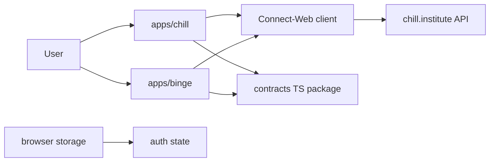
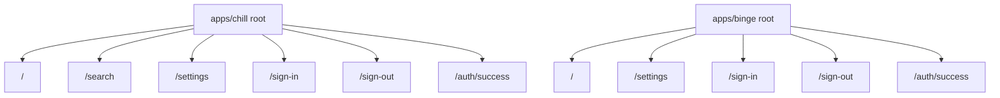
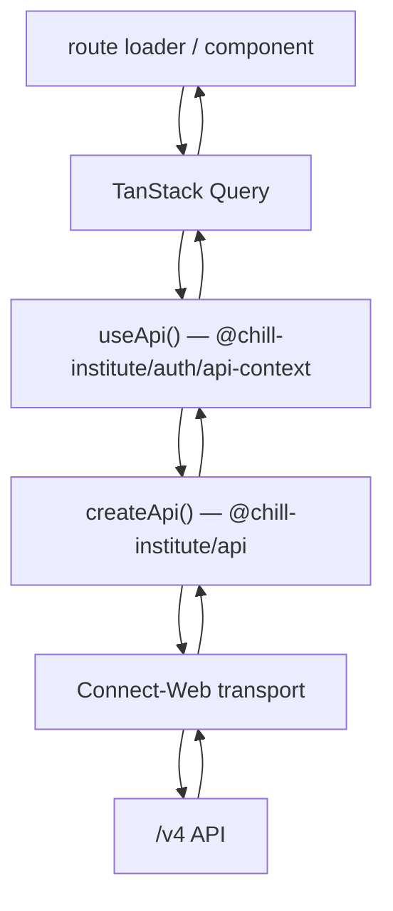
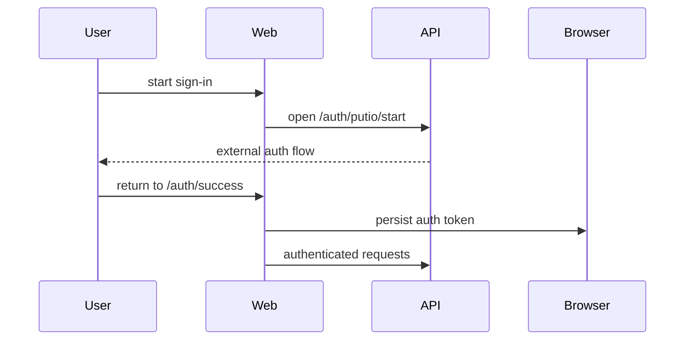

# Architecture

This document describes how `chill-web` is structured as a Vite+ workspace hosting both web apps.

## System Context

## Workspace Layout

| Path             | Responsibility                                                                              |
| ---------------- | ------------------------------------------------------------------------------------------- |
| `apps/chill/`    | `chill.institute` app — search experience (search shell + results table), settings, auth    |
| `apps/binge/`    | `binge.institute` app — catalog (movies + tv shows grids, detail modals), settings, auth    |
| `packages/ui/`   | `@chill-institute/ui` — purely presentational primitives, design tokens, pure hooks/lib     |
| `packages/auth/` | `@chill-institute/auth` — auth + api context + api-coupled components/queries/routes        |
| `packages/api/`  | `@chill-institute/api` — connect-rpc client, auth-error constants, settings/timeout helpers |
| repo root        | workspace scripts, Vite+ config, lint/format config, CI entrypoints                         |

The package graph is one-directional: both apps depend on all three packages; `packages/auth` depends on `packages/ui` and `packages/api`; `packages/ui` has no internal package dependencies.

## Workspace Tooling

The repo root owns the shared workspace contract:

- `package.json` for root commands such as `vp run verify`, `vp run verify:chill`, and `vp run e2e:binge`
- `pnpm-workspace.yaml` for package globs and shared dependency catalog entries
- `vite.config.ts` for root formatting, lint, and staged-check behavior
- `.github/workflows/` for selective verify, preview deploy, and production deploy wiring

Each app owns its app-local config:

- `components.json`
- `index.html`
- `playwright.config.ts`
- `tsconfig.json`
- `vite.config.ts`

## Runtime Model

- Each app is its own client-rendered SPA.
- The browser calls the hosted API directly for normal app traffic.
- Shared contract types come from `@chill-institute/contracts`.
- Shared UI primitives, auth wiring, and connect-rpc client live in `packages/ui`, `packages/auth`, and `packages/api` respectively. App-local code is reserved for surfaces that genuinely diverge (shells, search/catalog-specific components, source pickers).

## App Shape

Each app keeps the same broad internal layers:

| Layer         | Responsibility                                                     |
| ------------- | ------------------------------------------------------------------ |
| router        | route matching, loaders, navigation, auth-aware redirects          |
| queries       | cache and request lifecycle for route screens                      |
| API layer     | Connect-Web transport, auth headers, request IDs, response mapping |
| auth layer    | persist auth token and callback state in browser storage           |
| UI components | render shell, content surfaces, and settings                       |

## Route Model

Current route behavior:

| App          | Route                                    | Responsibility                                   |
| ------------ | ---------------------------------------- | ------------------------------------------------ |
| `apps/chill` | `/`                                      | shell and catalog home with initial data preload |
| `apps/chill` | `/search`                                | search flow, filters, and result listing         |
| `apps/chill` | `/settings`                              | user settings and folder-related configuration   |
| `apps/binge` | `/`                                      | catalog-focused home without the search flow     |
| `apps/binge` | `/settings`                              | user settings and folder-related configuration   |
| both apps    | `/sign-in`, `/sign-out`, `/auth/success` | auth lifecycle routes                            |

## Data Flow

Key frontend modules:

| Module                                                    | Responsibility                                                                                  |
| --------------------------------------------------------- | ----------------------------------------------------------------------------------------------- |
| `apps/*/src/router.tsx`                                   | create the app router and router context                                                        |
| `apps/*/src/query-client.ts`                              | shared TanStack Query client configuration for that app                                         |
| `apps/*/src/lib/api.tsx`                                  | thin app-local bridge: `createApi(token)` (route loaders) + `<*ApiProvider>` (React subtree)    |
| `apps/*/src/lib/env.ts`                                   | resolve the public API base URL from the current hostname                                       |
| `@chill-institute/api`                                    | typed connect-rpc client, auth header wiring, request IDs, auth redirects                       |
| `@chill-institute/auth/auth`                              | browser auth token lifecycle (PASETO + put.io OAuth callback storage), `AuthProvider`/`useAuth` |
| `@chill-institute/auth/api-context`                       | React context exposing the api client + `getPutioStartURL` to the rest of the tree              |
| `@chill-institute/auth/queries/{profile,download-folder}` | shared TanStack Query hooks                                                                     |
| `apps/*/src/queries/`                                     | app-specific query options and mutation helpers (settings, search, movies, tv-shows)            |
| `apps/*/src/routes/`                                      | screen entrypoints — auth-flow routes are 3-line shims onto `@chill-institute/auth/routes/*`    |

## Auth Flow

When authenticated requests fail with auth-related errors, the connect-rpc client (`@chill-institute/api`) clears client auth state and redirects through the sign-out path.

The auth lifecycle routes (`/sign-in`, `/sign-out`, `/auth/success`, `/auth/cli-token`, `/debug/crash`) are shared via `@chill-institute/auth/routes/*RouteOptions` — each app's route file is a 3-line shim that calls `createFileRoute("/path")(routeOptions)`. Both apps register the same options object so the OAuth dance, callback consumption, and sign-out flow stay byte-equivalent across the two apps.

## Environment

| Variable                   | Purpose                                    |
| -------------------------- | ------------------------------------------ |
| `VITE_PUBLIC_API_BASE_URL` | optional local override for the public API |

Hosted environments resolve the API from the current hostname in app-local files:

- `apps/chill/src/lib/api-origin.ts` handles `localhost`, `chill.institute`, `staging.chill.institute`, and `*.chill-institute.pages.dev`
- `apps/binge/src/lib/api-origin.ts` handles `localhost`, `binge.institute`, `staging.binge.institute`, and `*.binge-institute.pages.dev`

## Deployment Model

Build outputs are static bundles at:

- `apps/chill/dist/`
- `apps/binge/dist/`

Typical production shape:

- static assets on separate Cloudflare Pages projects
- API on a separate `api.chill.institute` origin
- browser -> API communication over Connect-Web
