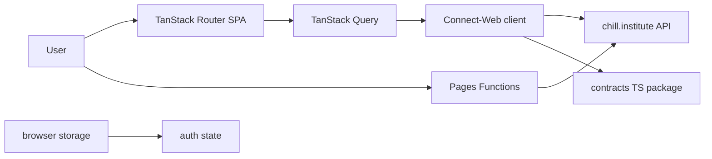
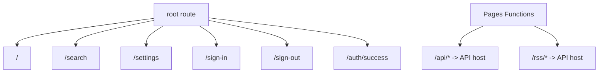
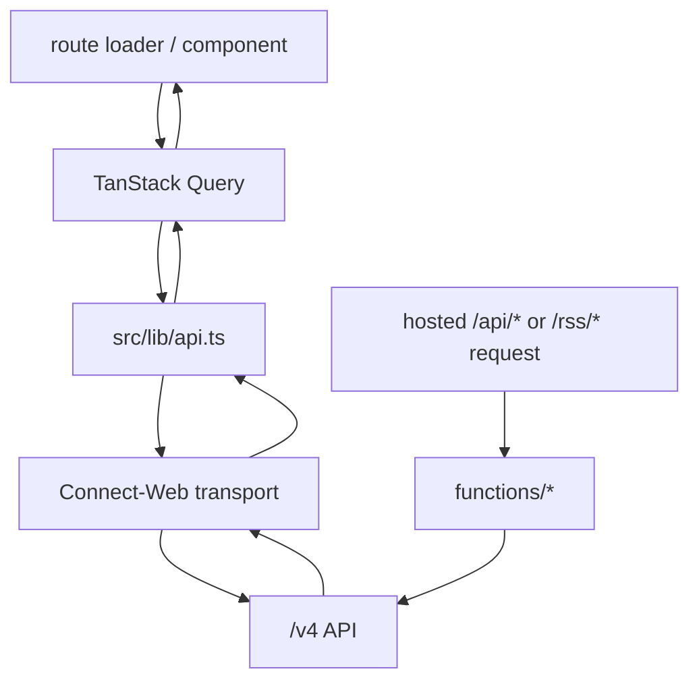
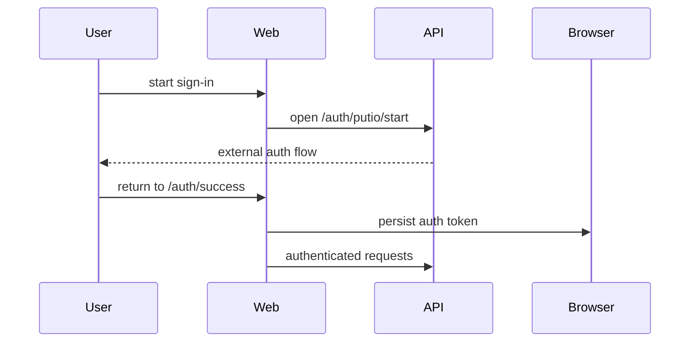

# Architecture

This document describes how `chill-institute/web` is built.

## System Context

## Components

| Component     | Responsibility                                                     | Talks to                             |
| ------------- | ------------------------------------------------------------------ | ------------------------------------ |
| Router layer  | Route matching, loaders, navigation, auth-aware redirects          | query client, route components       |
| API layer     | Connect-Web transport, auth headers, request IDs, response mapping | `chill.institute` API                |
| Edge layer    | Redirect legacy non-SPA `/api/*` and `/rss/*` paths to the API host | Cloudflare Pages, hosted API       |
| Query layer   | Cache and request lifecycle for route screens                      | API layer                            |
| Auth layer    | Persist auth token and callback state in browser storage           | sign-in/sign-out/auth success routes |
| UI components | Render search, settings, shell, and top-movies flows               | route state, query state             |

## Runtime Model

- This is a client-rendered SPA.
- The browser calls the hosted API directly for normal app traffic.
- Cloudflare Pages Functions handle legacy non-SPA route forwarding on hosted environments.
- Shared contract types come from `@chill-institute/contracts`.

## Route Model

Current route behavior:

| Route           | Responsibility                                 |
| --------------- | ---------------------------------------------- |
| `/`             | shell/home view with initial data preload      |
| `/search`       | search flow, filters, result listing           |
| `/settings`     | user settings and folder-related configuration |
| `/sign-in`      | begin auth flow                                |
| `/sign-out`     | clear client auth state                        |
| `/auth/success` | handle auth callback completion                |

## Data Flow

Key frontend modules:

| Module         | Responsibility                                                           |
| -------------- | ------------------------------------------------------------------------ |
| `router`       | create the app router and router context                                 |
| `query-client` | shared TanStack Query client configuration                               |
| `lib/api`      | typed API calls, auth header wiring, request IDs, auth failure redirects |
| `functions/*`  | Cloudflare Pages Functions for legacy path forwarding                    |
| `lib/auth`     | browser auth token lifecycle                                             |
| `queries`      | query options and mutation helpers for screens                           |
| `routes`       | screen entrypoints and route-specific loaders                            |

## Auth Flow

When authenticated requests fail with auth-related errors, the API layer clears client auth state and redirects through the sign-out path.

## Environment

| Variable                   | Purpose                                    |
| -------------------------- | ------------------------------------------ |
| `VITE_PUBLIC_API_BASE_URL` | optional local override for the public API |

Hosted environments resolve the API from the current hostname:

- `localhost` and `*.web-8vr.pages.dev` -> `https://api.binge.institute`
- `binge.institute` -> `https://api.binge.institute`
- `chill.institute` -> `https://api.chill.institute`

Hosted legacy forwarding uses the same host split:

- `/api/*` strips `/api` and redirects to the matching API host
- `/rss/*` preserves the full `/rss/...` path and redirects to the matching API host

## Deployment Model

The build output is a static bundle in `dist/`.

Typical production shape:

- static assets on Cloudflare Pages
- Pages Functions for legacy non-SPA forwarding
- API on a separate `chill.institute` origin
- browser -> API communication over Connect-Web
