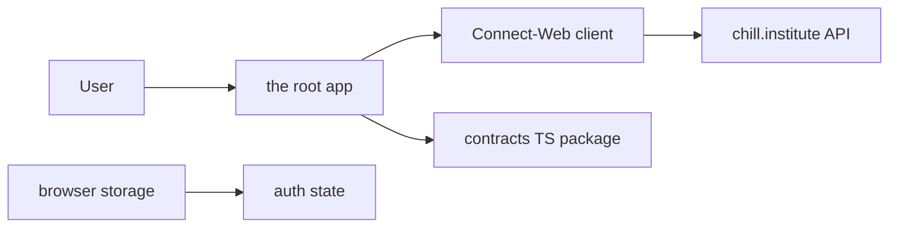
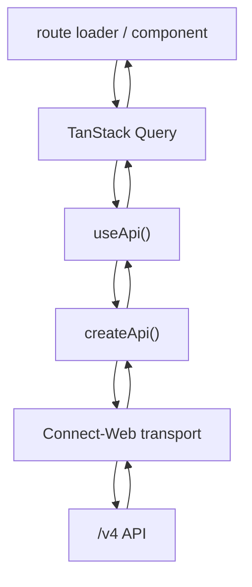

# Architecture

This document describes `chill-web` as a Vite+ repo hosting the `chill.institute` web app.

## System Context

## Layout

| Path        | Responsibility                                                                 |
| ----------- | ------------------------------------------------------------------------------ |
| `./`        | `chill.institute` app: search, movies, TV shows, settings, auth, and e2e tests |
| `src/ui/`   | presentational primitives, design tokens, pure hooks, and UI helpers           |
| `src/api/`  | Connect-RPC client, auth-error constants, settings defaults, and timeouts      |
| `src/auth/` | auth state, API context, auth routes, and API-coupled shared components        |
| repo root   | Vite+ config, dependencies, hooks, SST config, and CI entrypoints              |

The app keeps API, auth, UI, and catalog code local so there is no workspace package graph.

## Runtime Model

- The app is a client-rendered React SPA.
- The browser calls the hosted API directly.
- Shared contract types come from `@chill-institute/contracts`.
- `www.chill.institute`, `binge.institute`, and `www.binge.institute` redirect to `chill.institute`.
- There is no staging binge host.

## Boundaries

- `src/ui/` stays presentational and does not import auth or API code.
- `src/api/` owns Connect-RPC transport and API helpers.
- `src/auth/` owns token lifecycle, API context, auth routes, and API-coupled controls.
- `src/catalog/` owns movie and TV catalog behavior.
- `src/components/` owns app shell, search, settings, and cross-surface composition.

## Routes

| Route                                    | Responsibility                                 |
| ---------------------------------------- | ---------------------------------------------- |
| `/`                                      | search home shell                              |
| `/search`                                | search flow, filters, and result listing       |
| `/movies` and `/movies/$id`              | movie catalog and detail modal                 |
| `/tv-shows` and `/tv-shows/$id`          | TV catalog and detail modal                    |
| `/settings`                              | user settings and folder-related configuration |
| `/sign-in`, `/sign-out`, `/auth/success` | auth lifecycle routes                          |

## Data Flow

Key modules:

| Module                | Responsibility                                     |
| --------------------- | -------------------------------------------------- |
| `src/main.tsx`        | browser entrypoint and provider mounting           |
| `src/router.tsx`      | create the app router and router context           |
| `src/query-client.ts` | TanStack Query client configuration                |
| `src/lib/api.tsx`     | browser API base URL bridge and React API provider |
| `src/lib/env.ts`      | hosted API base URL resolution                     |
| `src/components/`     | search shell, settings, and app-level components   |
| `src/catalog/`        | movie and TV catalog routes, queries, and modals   |
| `src/auth/`           | auth token lifecycle, auth routes, and API context |
| `src/ui/`             | design tokens, primitives, and presentational UI   |

## Environment

| Variable                   | Purpose                                    |
| -------------------------- | ------------------------------------------ |
| `VITE_PUBLIC_API_BASE_URL` | optional local override for the public API |

Hosted environments resolve the API from the current hostname:

- `localhost`, `127.0.0.1`, and `*.chill.institute` use the production API by default
- `api.chill.institute` can use the current origin for API-local debug flows

## Deployment

Build output is `dist/`.

Production hosting shape:

- static assets on SST-managed Cloudflare Workers
- `www.chill.institute` and `binge.institute` production domains handled by a redirect worker
- API on a separate `api.chill.institute` origin
