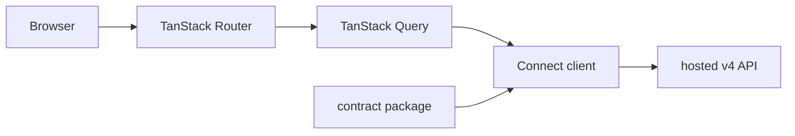

# Architecture

`chill-web` is a client-rendered React app. The browser calls the hosted API
through Connect and imports public types from `@chill-institute/contracts`.

```mermaid
graph LR
  Browser --> Router["TanStack Router"]
  Router --> Query["TanStack Query"]
  Query --> Connect["Connect client"]
  Connect --> API["hosted v4 API"]
  Contracts["contract package"] --> Connect
```

## Ownership

| Path              | Owns                                                   |
| ----------------- | ------------------------------------------------------ |
| `src/routes/`     | File-route shims and route composition                 |
| `src/api/`        | Connect transport, API helpers, defaults, and timeouts |
| `src/auth/`       | Tokens, API context, auth routes, coupled controls     |
| `src/catalog/`    | Movie and TV queries, routes, and modals               |
| `src/ui/`         | Design tokens, primitives, pure hooks, presentation    |
| `src/components/` | App shell, search, settings, cross-surface UI          |

`src/ui/` must not import auth or API code. Product behavior stays in the
hosted API; the web repo owns browser state, requests, and rendering.

## Routes

| Route                              | Surface                              |
| ---------------------------------- | ------------------------------------ |
| `/`, `/search`                     | Search shell, filters, and results   |
| `/movies`, `/movies/$id`           | Movie catalog and detail modal       |
| `/tv-shows`, `/tv-shows/$id`       | TV catalog and detail modal          |
| `/settings`                        | Account and folder settings          |
| `/sign-in`, `/sign-out`, `/auth/*` | Browser and CLI-token authentication |

One `UserSettings.catalog.sort` preference applies across movies, TV, and all
providers, independently of search sorting. Picker changes save to put.io through
the settings mutation. A `sort` search param overrides it for that URL without
changing the saved preference. Sort values, legacy `year-*` aliases, and tie
rules live in [`src/catalog/lib/sort.ts`](../src/catalog/lib/sort.ts) and its
tests.

## Request Path

Routes call TanStack Query hooks, which obtain the API client from auth context.
The transport sends requests to `/v4`, identifies itself as `web`, and includes
the deployment version in `X-Chill-Client-Version`.

Hosted response data is untrusted. Timeouts, auth failures, route recovery,
and errors are explicit UI states.

## Environment

| Variable                         | Purpose                                 |
| -------------------------------- | --------------------------------------- |
| `VITE_PUBLIC_API_BASE_URL`       | Local API override                      |
| `VITE_PUBLIC_VERSION`            | Public mainline version sent to the API |
| `VITE_PUBLIC_RELEASE`            | Commit release used for debugging       |
| `VITE_PUBLIC_SENTRY_DSN`         | Browser crash-reporting DSN             |
| `VITE_PUBLIC_SENTRY_ENVIRONMENT` | Crash-reporting environment             |
| `SENTRY_AUTH_TOKEN`              | CI-only source-map upload token         |
| `SENTRY_ORG`, `SENTRY_PROJECT`   | Source-map destination                  |

Sentry stays off unless a public DSN is present. It excludes product analytics,
session replay, default PII, request bodies, query strings, and default browser
breadcrumbs. Known extension noise and recoverable module-load failures are
dropped; terminal failures remain reportable. Filters live in
[`src/lib/sentry.ts`](../src/lib/sentry.ts).

Build, smoke, and artifact verification are described in
[Deployment](./DEPLOYMENT.md).

## Stremio setup

`/stremio` manages private installations through the hosted adapter. The browser
sends its ordinary chill token only in an Authorization header. Installation
links carry a separate revocable capability: never include them in telemetry,
public screenshots, or support reports. The folder picker uses read-only
`GetFolder`; selecting a folder here does not change download settings.

Setup presents **Connect account → Install chill**. Connecting creates a private
installation for the selected folder; existing connections retain install, copy
and revoke actions. Stremio Web and other devices can install by pasting the link
into their add-on search. Clipboard failures leave a selectable link for manual
copying. The chosen folder survives connection errors.

Account setup, installation and revocation are the only Web responsibilities.
Discovery, release selection, downloads to put.io, progress and playback stay in
Stremio. The installation capability delegates library playback and selected-release
downloads to the linked put.io account. Revocation stops future requests, but does
not cancel transfers already started or invalidate playback URLs already issued.

`VITE_PUBLIC_STREMIO_BASE_URL` configures the hosted adapter origin at build time
(default `https://stremio.chill.institute`). Use HTTPS; local HTTP is accepted
only in development on localhost. Hosting, capability persistence, provider
transfers, and revocation belong to `chill-stremio`.

Fixture browser coverage is `pnpm exec vp exec playwright test e2e/stremio.spec.ts`;
visual coverage is under `e2e/visual/stremio.visual.spec.ts`. These tests never use
real credentials or start provider transfers.
