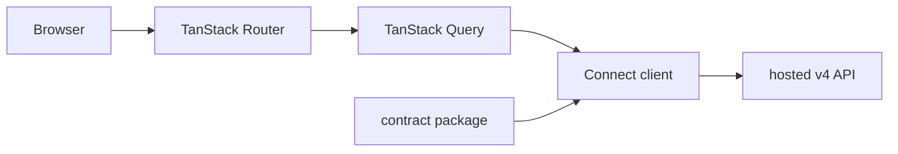

# Architecture

`chill-web` is a client-rendered React app. The browser calls the hosted API
through Connect and imports public types from `@chill-institute/contracts`.

```mermaid
graph LR
  Browser --> Router["TanStack Router"]
  Router --> Query["TanStack Query"]
  Query --> Connect["Connect client"]
  Connect --> API["hosted v4 API"]
  Contracts["contract package"] --> Connect
```

## Ownership

| Path              | Owns                                                   |
| ----------------- | ------------------------------------------------------ |
| `src/routes/`     | File-route shims and route composition                 |
| `src/api/`        | Connect transport, API helpers, defaults, and timeouts |
| `src/auth/`       | Tokens, API context, auth routes, coupled controls     |
| `src/catalog/`    | Movie and TV queries, routes, and modals               |
| `src/ui/`         | Design tokens, primitives, pure hooks, presentation    |
| `src/components/` | App shell, search, settings, cross-surface UI          |

`src/ui/` must not import auth or API code. Product behavior stays in the
hosted API; the web repo owns browser state, requests, and rendering.

## Routes

| Route                              | Surface                              |
| ---------------------------------- | ------------------------------------ |
| `/`, `/search`                     | Search shell, filters, and results   |
| `/movies`, `/movies/$id`           | Movie catalog and detail modal       |
| `/tv-shows`, `/tv-shows/$id`       | TV catalog and detail modal          |
| `/settings`                        | Account and folder settings          |
| `/sign-in`, `/sign-out`, `/auth/*` | Browser and CLI-token authentication |

## Request Path

Routes call TanStack Query hooks, which obtain the API client from auth context.
The transport sends requests to `/v4`, identifies itself as `web`, and includes
the deployment version in `X-Chill-Client-Version`.

Hosted response data is untrusted. Browser-side timeouts, auth failures, route
recovery, and errors remain explicit UI states.

## Environment

| Variable                         | Purpose                                 |
| -------------------------------- | --------------------------------------- |
| `VITE_PUBLIC_API_BASE_URL`       | Local API override                      |
| `VITE_PUBLIC_VERSION`            | Public mainline version sent to the API |
| `VITE_PUBLIC_RELEASE`            | Commit release used for debugging       |
| `VITE_PUBLIC_SENTRY_DSN`         | Browser crash-reporting DSN             |
| `VITE_PUBLIC_SENTRY_ENVIRONMENT` | Crash-reporting environment             |
| `SENTRY_AUTH_TOKEN`              | CI-only source-map upload token         |
| `SENTRY_ORG`, `SENTRY_PROJECT`   | Source-map destination                  |

Sentry stays off unless a public DSN is present. It excludes product analytics,
session replay, default PII, request bodies, query strings, and default browser
breadcrumbs. Known extension noise and recoverable module-load failures are
dropped; terminal failures remain reportable.

Production and staging upload hidden source maps, delete them from `dist/`, run
sign-in and settings-shell browser smoke against that final directory, and deploy
only after its SHA-256 manifest verifies. Pull requests run the fuller functional
browser suite; browser fixtures mock API and health responses. See [Deployment](./DEPLOYMENT.md).
